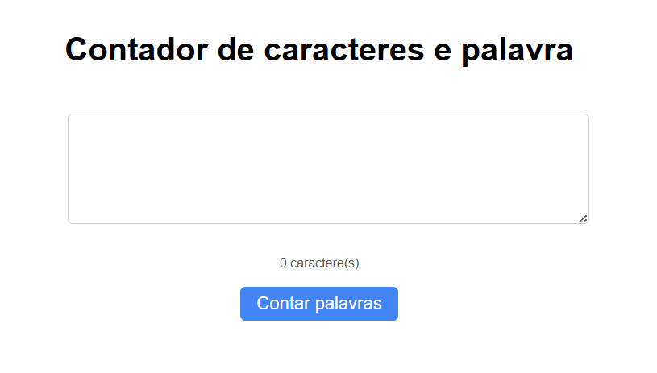
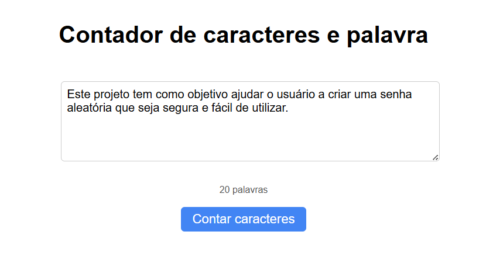
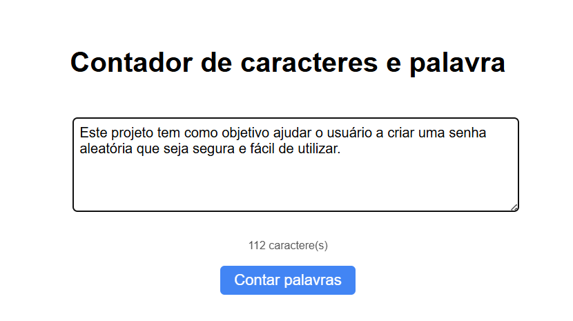

# Contador de Caracteres e Palavras

Este é um aplicativo simples e interativo que conta o número de caracteres ou palavras em um texto. Desenvolvido com **HTML, CSS e JavaScript puro**, ele oferece uma ferramenta prática para escritores, estudantes ou qualquer pessoa que precise de uma contagem rápida e dinâmica enquanto digita.

🔗 Acesse o projeto online  
https://guiihsantos.github.io/Contador-De-Caracteres/

## Funcionalidades

- **Contagem Dinâmica**: O contador é atualizado em tempo real conforme você digita.
- **Alternar Modo**: Você pode facilmente alternar entre os modos de contagem de **caracteres** e **palavras** com um único botão.
- **Interface Simples**: O design minimalista e intuitivo torna a ferramenta fácil de usar.

## 📦 Tecnologias usadas:

- 
- 
- 

## 📷 Imagens do projeto:

  
 
    
    
    
  

